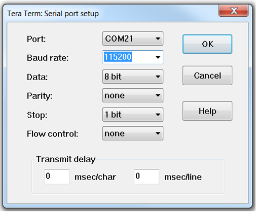

# STM32-Bluetooth-6LOWPAN
This BLE 6LoWPAN project implements the 6lo (IPv6) over BLE (Bluetooth low energy) adaptation layer functionality on X-NUCLEO-IDB05A1 BLE device along with a STM32 Nucleo-401RE development board. 

# Getting started with this software package

This software provides a 6LoWPAN and IPv6 interface from [Nucleo-401RE](https://www.st.com/en/evaluation-tools/nucleo-f401re.html) and [X-Nucleo-IDB05A1](https://www.st.com/en/embedded-software/x-cube-ble1.html) based platform to a [Raspberry PI 3 Model B+](https://www.raspberrypi.org/products/raspberry-pi-3-model-b-plus/) platform over Bluetooth.

## Hardware Requirements

The following hardware components are needed to run and test the software:
1.  One [Nucleo-401RE](https://www.st.com/en/evaluation-tools/nucleo-f401re.html) Development platform
2.  One [X-Nucleo-IDB05A1](https://www.st.com/en/embedded-software/x-cube-ble1.html) Bluetooth expansion board
3.  One USB type A to Mini-B USB cable to connect the STM32 Nucleo to the PC
4.  One [Raspberry PI 3 Model B+](https://www.raspberrypi.org/products/raspberry-pi-3-model-b-plus/) platform.
5.  One Windows PC

## Development Toolchain

To build the software you need [IAR Embedded Workbench for ARM® V8.30.2](https://www.iar.com/iar-embedded-workbench/#!?architecture=Arm) chain.

## Raspberry PI Setup

To setup Raspberry PI refer to  Nordic Semiconductor topic [“Setting up BLE 6LoWPAN Border Router”](https://infocenter.nordicsemi.com/index.jsp?topic=%2Fcom.nordic.infocenter.sdk5.v14.2.0%2Fiot_ug_border_router.html) at Software Development Kit > Previous versions of nRF5 SDK > nRF5 SDK v14.2.0 > User Guides > IoT User Guide

## Nucleo Hardware Setup

The Nucleo board is powered by the mini-USB connector and that is also used for I/O and Debug interaction with a Windows PC. This Windows PC should have the IAR build tool and ST-Link driver to detect the Nucleo Device.

 
Figure 1: X-Nucleo-IDB05A1 plugged on Nucleo-401RE

-   Plug the BlueNRG daughterboard into J4 and J5 connectors as in above figure.
-   Ensure the jumper configuration on the daughterboard is as in above Figure.
-   Connect the Nucleo Board to the PC with a Mini-B USB cable (through connector CN1). 
-   Verify the PWR LED lights is on.

## Serial Terminal Setup

To see the Debug prints from the board, you must set up a serial terminal on the Windows PC. Tera Term is used in the example below, but you can use any other similar tool.

-   Determine the STM32 ST-LINK Virtual COM port allocated to the STM32 Nucleo board in your Windows PC after Nucleo Board is connected to the PC.
-   Open a serial terminal on the PC and connect it to the above virtual COM port.
-   Configure the COM port number Baud rate and the other parameters as shown below.
 
 
Figure 2: Tera Term opened to STLink Virtual COM port

 
Figure 3: Set terminal port Baud rate

 
Figure 4: Set New-Line

## Run the Firmware Application

-   Open the application from Root_path\Projects\STM32F401RE-Nucleo\Applications\SampleApp\EWARM\Project.eww
-   Build the application and download to board. 
-   Run it.
-   See the output on terminal.

 
Figure 5: Nucleo Bluetooth Platform ready for connection

-   Run the connect command from Raspberry PI Terminal.

>echo “connect F5:09:0D:7E:A1:F6 1” > /sys/kernel/debug/bluetooth/6lowpan_control

 
 
Figure 6: Nucleo Bluetooth Platform connected to LBR and ready for ping

    Now the platform is connected to RPI LBR @ a IPv6 address: FE80::B827:EBFF:FE3D:4F70.

-   You can ping6 the Nucleo platform from the Raspberry Pi.

>ping6 -c1 -I bt0 fe80::f509:dff:fe7e:a1f6

 
 
Figure 7: ping request from remote LBR to Nucleo

 
Figure 8: ping response reached on RPI LBR from Nucleo Platform

-   You can ping from Nucleo platform to RPI by just pressing Blue button.

 
Figure 9: ping request from Nucleo to remote LBR 
